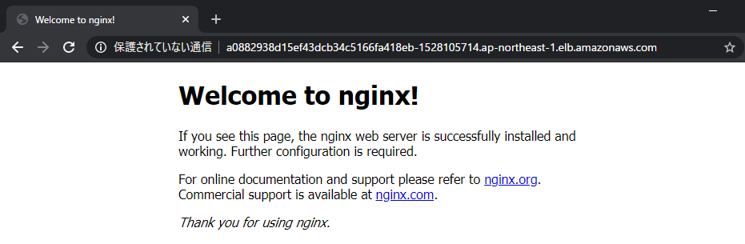

# 201-1 Deploy a simple configuration on K8s

## 0. Labs tips

One of the good practice in K8S is also to know the documentation because you can find some tips to help you. 
Here the cheatsheet : https://kubernetes.io/docs/reference/kubectl/cheatsheet/

where you can install the autocomplete cli :
```
source <(kubectl completion bash) # setup autocomplete in bash into the current shell, bash-completion package should be installed first.
echo "source <(kubectl completion bash)" >> ~/.bashrc # add autocomplete permanently to your bash shell.
```

## 1. Login to the bastion server

Using your terminal emulator such as WSL, putty or ConEmu, login to the server.

## 2. Make sure you have the .kube/config file to connect to the Kuberentes API server

```
$ ls -l $HOME/.kube/config
```

## 3. Try kubectl; the CLI tool for Kuberetes

You should get something similar to the following example.

```
$ kubectl get node
NAME                                               STATUS   ROLES    AGE   VERSION
ip-192-168-51-82.ap-northeast-1.compute.internal   Ready    <none>   55m   v1.16.8-eks-e16311
ip-192-168-9-90.ap-northeast-1.compute.internal    Ready    <none>   55m   v1.16.8-eks-e16311
ip-192-168-90-1.ap-northeast-1.compute.internal    Ready    <none>   55m   v1.16.8-eks-e16311
```

## 4. Let's deploy a simple nginx application with a Cloud Load Balancer

Clone the hands-on repository on your bastion and run `kubectl apply`!

```
$ git clone https://github.com/HIT-CNC/CNC-Handson-201.git
$ cd simple-k8s
$ kubectl apply -f app.yaml
```

Let's see your application has been deployed.

```
$ kubectl get pod
NAME                               READY   STATUS    RESTARTS   AGE
nginx-deployment-59bbf75fb-55fbl   1/1     Running   0          24s
nginx-deployment-59bbf75fb-j8jzv   1/1     Running   0          24s
nginx-deployment-59bbf75fb-x6d5n   1/1     Running   0          24s
```

and then, a cloud load balancer has been deployed for your application.

```
$ kubectl get service
NAME            TYPE           CLUSTER-IP      EXTERNAL-IP                                                                    PORT(S)        AGE
kubernetes      ClusterIP      10.100.0.1      <none>                                                                         443/TCP        66m
nginx-service   LoadBalancer   10.100.59.252   a0882938d15ef43dcb34c5166fa418eb-1528105714.ap-northeast-1.elb.amazonaws.com   80:31719/TCP   60s
```

Now, look at the `EXTERNAL-IP` section for `nginx-service`. Copy the address and go to the URL on your browser!

Note that it can take some time to get the Cloud Load Balancer available.



Once you confirm your application is wokring, let's delete all the resources you've created on your cluster.

Run the following command.

```
$ kubectl delete -f app.yaml

or

$ kubectl delete service nginx-service
$ kubectl delete deployment nginx
```

These two ways means the same thing here, but the former indicates delete all the resources that are declared in the YAML file.
