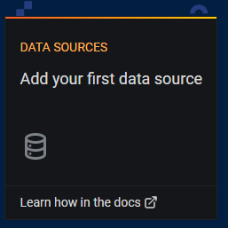
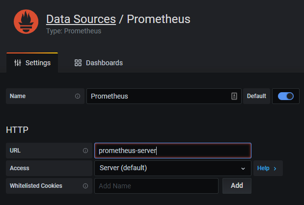
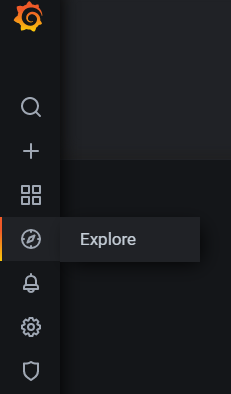

# 201-3 Deploy a multi-tenant configuration on K8s

## 1. Login to the bastion server

Using your terminal emulator such as WSL, putty or ConEmu, login to the server.

## 2. Install Helm

Install Helm package on your SSH host.

```shell
$ curl https://helm.baltorepo.com/organization/signing.asc | sudo apt-key add -
$ sudo apt-get install apt-transport-https --yes
$ echo "deb https://baltocdn.com/helm/stable/debian/ all main" | sudo tee /etc/apt/sources.list.d/helm-stable-debian.list
$ sudo apt-get update
$ sudo apt-get install helm
```

## 3. Let's try to install Prometheus and Grafana using Helm chart!

As explained in the hands-on session, Helm is a package manager for Kubernetes. It hides a lot of "unnecessary part" of Kubernetes so that infra operators can easily provison that they need. But you need to be aware that it does not mean you don't have to learn about what you're installing in your kUbernetes.

Now, let's try a quick installation with Helm! This time we will install Prometheus and Grafana; which are one of the most popular monitoring system especially in Kubernetes world.

Setup helm and the necessary namepsaces

```shell
$ kubectl create namespace monitoring
```

## 4. Setup Grafana

Setup the secret.

```shell
$ kubectl create secret generic grafana-creds \
  --from-literal=GF_SECURITY_ADMIN_USER=admin \
  --from-literal=GF_SECURITY_ADMIN_PASSWORD=admin1234 \
  -n monitoring
```

Apply Grafana deployment.

```shell
$ kubectl apply -f grafana-pvc.yaml
$ kubectl apply -f grafana-deployment.yaml
$ kubectl apply -f grafana-service.yaml
```

## 5. Install Prometheus with Helm

Now, install Prometheus!

```shell
$ helm install prometheus stable/prometheus \
    --namespace monitoring \
    --set alertmanager.persistentVolume.storageClass="gp2",server.persistentVolume.storageClass="gp2"
```

Grafana has been installed with a cloud load balancer in the monitoring namespace. We need the service URL to access to the WebUI.

```shell
$ kubectl get service -n monitoring
kg svc -n monitoring
NAME                                  TYPE           CLUSTER-IP       EXTERNAL-IP                                                                   PORT(S)          AGE
grafana                               LoadBalancer   10.100.166.64    af9da45b0450945409ce6fdd27b7a81d-750039418.ap-northeast-1.elb.amazonaws.com   3000:30112/TCP   92m
prometheus-1594096167-alertmanager    ClusterIP      10.100.202.223   <none>                                                                        80/TCP           92m
prometheus-1594096167-node-exporter   ClusterIP      None             <none>                                                                        9100/TCP         92m
prometheus-1594096167-pushgateway     ClusterIP      10.100.22.162    <none>                                                                        9091/TCP         92m
prometheus-1594096167-server          ClusterIP      10.100.82.70     <none>                                                                        80/TCP           92m
```

Grafana server has AWS loadbalancer's alias record.  Now, access to `http://your-external-ip-value` on your browser.

**Note that it takes several minutes to provison the AWS LoadBalancer**

## 6. Setup Grafana

Access grafana with the loadbalancer FQDN.

Login with grafana admin user and password that you set in grafana-creds secret.



Select `Prometheus` and type `prometheus-server` in URL and then `Save & Test`.



Go back to Data Sources tab and you can see Prometheus has been added as a data source.



Now, go to `Explore`, then you can see the types of metrics that Prometheus exports to Grafana.

## 7. Import Dashboards(Optional)

GrafanaLabs offer a lot of Dashboard presets that displays important metrics for monitoring some types of infra environments.

Ref. https://grafana.com/grafana/dashboards

Let's try some useful dashboard samples that assist you monitoring Kubernetes clusters!

- [Kubernetes cluster monitoring (via Prometheus)](https://grafana.com/grafana/dashboards/315)
- [Node Exporter Full](https://grafana.com/grafana/dashboards/1860)

To import a dashboard, Click the "+" button then import. Type the ID in a dashboard page then you're all set.
